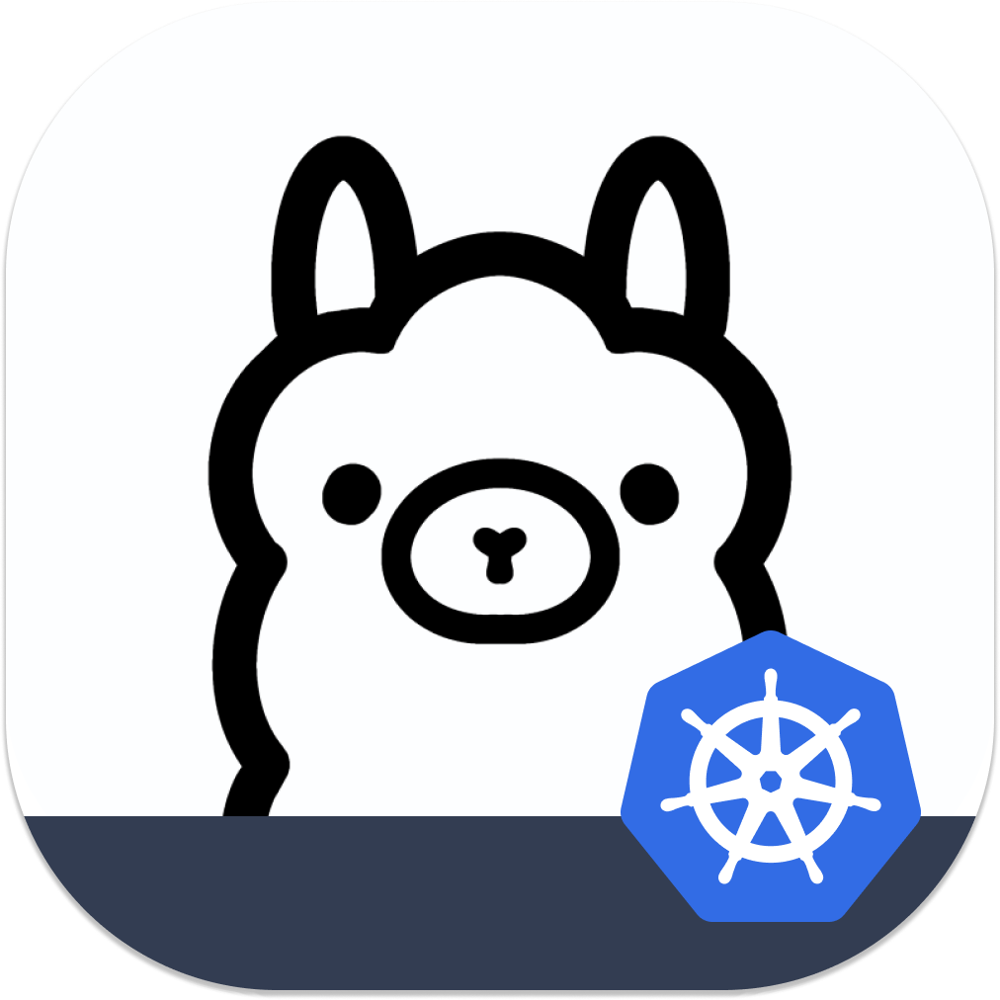
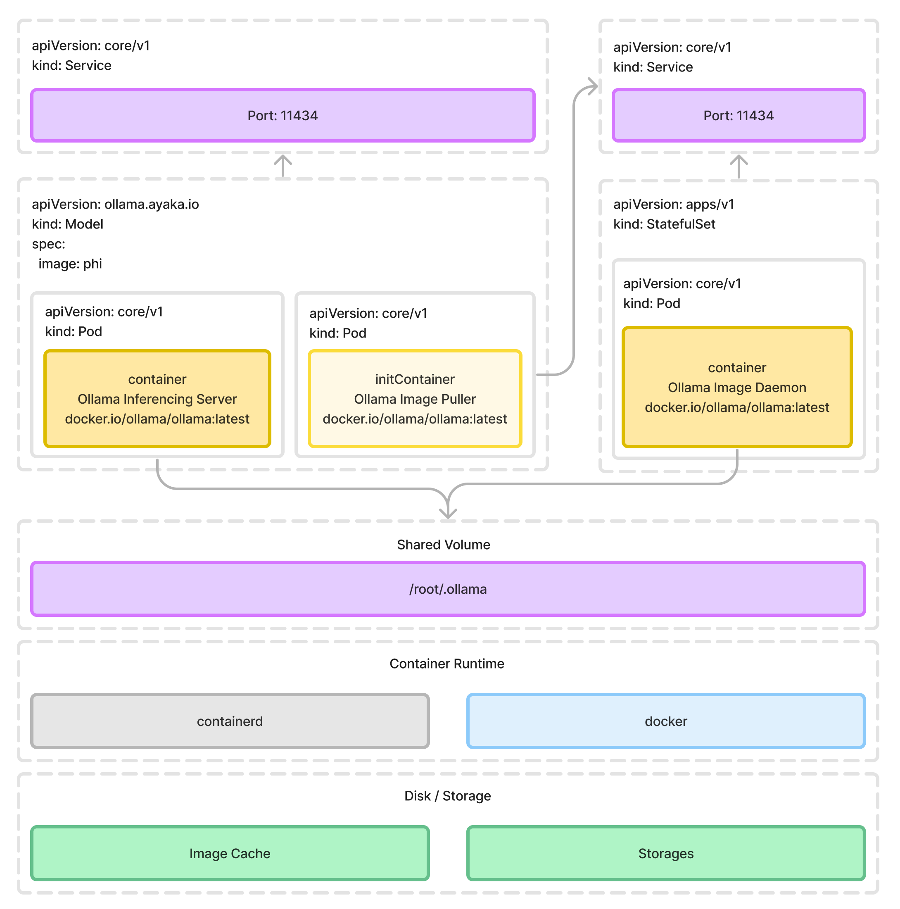

<div align="center">
  
</div>

# Ollama Operator

[](https://discord.gg/ollama)

> Yet another operator for running large language models on Kubernetes with ease. 🙀
>
> Powered by **[Ollama](https://github.com/ollama/ollama)**! 🐫

While [Ollama](https://github.com/ollama/ollama) is a powerful tool for running large language models locally, and the user experience of CLI is just the same as using Docker CLI, it's not possible yet to replicate the same user experience on Kubernetes, especially when it comes to running multiple models on the same cluster with loads of resources and configurations.

That's where the Ollama Operator kicks in:

- Install the operator on your Kubernetes cluster
- Apply the needed CRDs
- Create your models
- Wait for the models to be fetched and loaded, that's it!

Thanks to the great works of [lama.cpp](https://github.com/ggerganov/llama.cpp), **no more worries about Python environment, CUDA drivers.**

The journey to large language models, AIGC, localized agents, [🦜🔗 Langchain](https://www.langchain.com/) and more is just a few steps away!

## Features

- ✅ Abilities to run multiple models on the same cluster.
- ✅ Compatible with all Ollama models, APIs, and CLI.
- ✅ Able to run on [general Kubernetes clusters](https://kubernetes.io/), [K3s clusters](https://k3s.io/) (Respberry Pi, TrueNAS SCALE, etc.), [kind](https://kind.sigs.k8s.io/), [minikube](https://minikube.sigs.k8s.io/docs/), etc. You name it!
- ✅ Easy to install, uninstall, and upgrade.
- ✅ Pull image once, share across the entire node (just like normal images).
- ✅ Easy to expose with existing Kubernetes services, ingress, etc.
- ✅ Doesn't require any additional dependencies, just Kubernetes

## Getting started

### Install operator

```shell
kubectl apply -f https://raw.githubusercontent.com/nekomeowww/ollama-operator/main/dist/install.yaml
```

### Wait for the operator to be ready

```shell
kubectl wait --for=jsonpath='{.status.replicas}'=2 deployment/ollama-operator-controller-manager -n ollama-operator-system
```

### Deploy a model

> [!NOTE]
> You can also use the `kollama` CLI natively shipped by Ollama Operator, and will be easier to interact with the operator.
>
> Install `kollama` CLI:
>
> ```shell
> go install github.com/nekomeowww/ollama-operator/cmd/kollama@latest
> ```
>
> Deploy a model can be done with the following command:
>
> ```shell
> kollama deploy phi --expose --node-port 30001
> ```
>
> More information can be found at [CLI](https://ollama-operator.ayaka.io/pages/en/guide/getting-started/cli.html)

> [!IMPORTANT]
> Working with `kind`?
>
> The default provisioned `StorageClass` in `kind` is `standard`, and will only work with `ReadWriteOnce` access mode, therefore if you would need to run the operator with `kind`, you should specify `persistentVolume` with `accessMode: ReadWriteOnce` in the `Model` CRD:
> ```yaml
> apiVersion: ollama.ayaka.io/v1
> kind: Model
> metadata:
>   name: phi
> spec:
>   image: phi
>   persistentVolume:
>     accessMode: ReadWriteOnce
> ```

Let's create a `Model` CRD for the model `phi`:

```yaml
apiVersion: ollama.ayaka.io/v1
kind: Model
metadata:
  name: phi
spec:
  image: phi
```

Apply the `Model` CRD to your Kubernetes cluster:

```shell
kubectl apply -f ollama-model-phi.yaml
```

Wait for the model to be ready:

```shell
kubectl wait --for=jsonpath='{.status.readyReplicas}'=1 deployment/ollama-model-phi
```

### Access the model

1. Ready! Now let's forward the ports to access the model:

```shell
kubectl port-forward svc/ollama-model-phi ollama
```

7. Interact with the model:

```shell
ollama run phi
```

### Full options

```yaml
apiVersion: ollama.ayaka.io/v1
kind: Model
metadata:
  name: phi
spec:
  # Scale the model to 2 replicas
  replicas: 2
  # Use the model image `phi`
  image: phi
  imagePullPolicy: IfNotPresent
  storageClassName: local-path
  # If you have your own PersistentVolumeClaim created
  persistentVolumeClaim: your-pvc
  # If you need to specify the access mode for the PersistentVolume
  persistentVolume:
    accessMode: ReadWriteOnce
```

## Supported models

Unlock the abilities to run the following models with the Ollama Operator over Kubernetes:

> [!TIP]
> By the power of [`Modelfile`](https://github.com/ollama/ollama/blob/main/docs/modelfile.md) backed by Ollama, you can create and bundle any of your own model. **As long as it's a GGUF formatted model.**

| Model                   | Parameters | Size  | Model image         | Full model image URL                           |
| ----------------------- | ---------- | ----- | ------------------- | ---------------------------------------------- |
| Llama 2                 | 7B         | 3.8GB | `llama2`            | `registry.ollama.ai/library/llama2`            |
| Mistral                 | 7B         | 4.1GB | `mistral`           | `registry.ollama.ai/library/mistral`           |
| Dolphin Phi             | 2.7B       | 1.6GB | `dolphin-phi`       | `registry.ollama.ai/library/dolphin-phi`       |
| Phi-2                   | 2.7B       | 1.7GB | `phi`               | `registry.ollama.ai/library/phi`               |
| Neural Chat             | 7B         | 4.1GB | `neural-chat`       | `registry.ollama.ai/library/neural-chat`       |
| Starling                | 7B         | 4.1GB | `starling-lm`       | `registry.ollama.ai/library/starling-lm`       |
| Code Llama              | 7B         | 3.8GB | `codellama`         | `registry.ollama.ai/library/codellama`         |
| Llama 2 Uncensored      | 7B         | 3.8GB | `llama2-uncensored` | `registry.ollama.ai/library/llama2-uncensored` |
| Llama 2 13B             | 13B        | 7.3GB | `llama2:13b`        | `registry.ollama.ai/library/llama2:13b`        |
| Llama 2 70B             | 70B        | 39GB  | `llama2:70b`        | `registry.ollama.ai/library/llama2:70b`        |
| Orca Mini               | 3B         | 1.9GB | `orca-mini`         | `registry.ollama.ai/library/orca-mini`         |
| Vicuna                  | 7B         | 3.8GB | `vicuna`            | `registry.ollama.ai/library/vicuna`            |
| LLaVA                   | 7B         | 4.5GB | `llava`             | `registry.ollama.ai/library/llava`             |
| Gemma                   | 2B         | 1.4GB | `gemma:2b`          | `registry.ollama.ai/library/gemma:2b`          |
| Gemma                   | 7B         | 4.8GB | `gemma:7b`          | `registry.ollama.ai/library/gemma:7b`          |

Full list of available images can be found at [Ollama Library](https://ollama.com/library).

> [!WARNING]
> You should have at least 8 GB of RAM available on your node to run the 7B models, 16 GB to run the 13B models, and 32 GB to run the 33B models.

> [!WARNING]
> The actual size of downloaded large language models are huge by comparing to the size of general container images.
>
> 1. Fast and stable network connection is recommended to download the models.
> 2. Efficient storage is required to store the models if you want to run models larger than 13B.

## Architecture Overview

There are two major components that the Ollama Operator will create for:

1. **Model Inferencing Server**: The model inferencing server is a gRPC server that runs the model and serves the model's API. It is created as a `Deployment` in the Kubernetes cluster.
2. **Model Image Storage**: The model image storage is a `PersistentVolume` that stores the model image. It is created as a `StatefulSet` along with a `PersistentVolumeClaim` in the Kubernetes cluster.

> [!NOTE]
> The image that created by [`Modelfile`](https://github.com/ollama/ollama/blob/main/docs/modelfile.md) of Ollama is a valid OCI format image, however, due to the incompatible `contentType` value, and the overall structure of the `Modelfile` image to the general container image, it's not possible to run the model directly with the general container runtime. Therefore a standalone service/deployment of **Model Image Storage** is required to be persisted on the Kubernetes cluster in order to hold and cache the previously downloaded model image.

The detailed resources it creates, and the relationships between them are shown in the following diagram:

<picture>
  <source
    srcset="./docs/public/architecture-theme-night.png"
    media="(prefers-color-scheme: dark)"
  />
  <source
    srcset="./docs/public/architecture-theme-day.png"
    media="(prefers-color-scheme: light), (prefers-color-scheme: no-preference)"
  />
  
</picture>

## Contributing

- Refer to the [CONTRIBUTING.md](CONTRIBUTING.md) for more information.
- More information can be found via the [Kubebuilder Documentation](https://book.kubebuilder.io/introduction.html)

## Acknowledgements

Gratefully thanks to the following projects and their authors, contributors:

- [Ollama](https://github.com/ollama/ollama)
- [llama.cpp](https://github.com/ggerganov/llama.cpp)
- [Kubebuilder](https://book.kubebuilder.io/introduction.html)

It is because of their hard work and contributions that this program exists.
